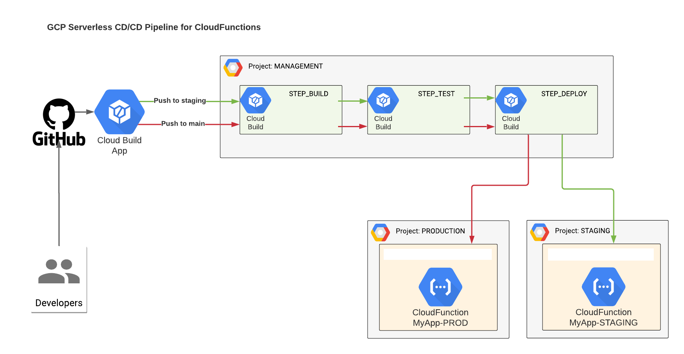

## NodeJS App for GCP Cloud Functions deployed via GCP Cloud Build

  

In order to deploy via Cloud Build located in project MANAGMENT (SHARED-SERVICES) to CloudFunction located in project STAGE,PROD you will need:

1. In project SHARED-SERVICES, get email of account for `xxxxxxxx@cloudbuild.gserviceaccount.com`
2. In project STAGE and PROD add this account as princial into IAM and add Roles:

     | IAM Role Name             | IAM Role Permission             |
     |---------------------------|---------------------------------|
     | Cloud Functions Developer | `roles/cloudfunctions.developer`|
     | Service Account User      | `roles/iam.serviceAccountUser`  |

### Copyleft (c) by Michael Kravtsiv
